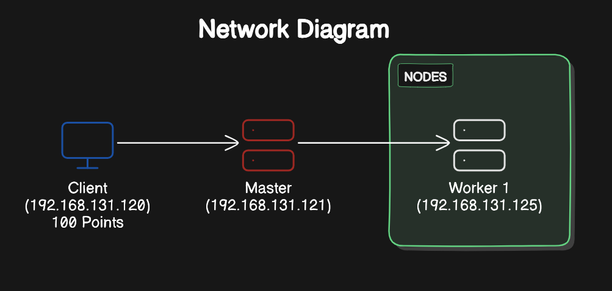
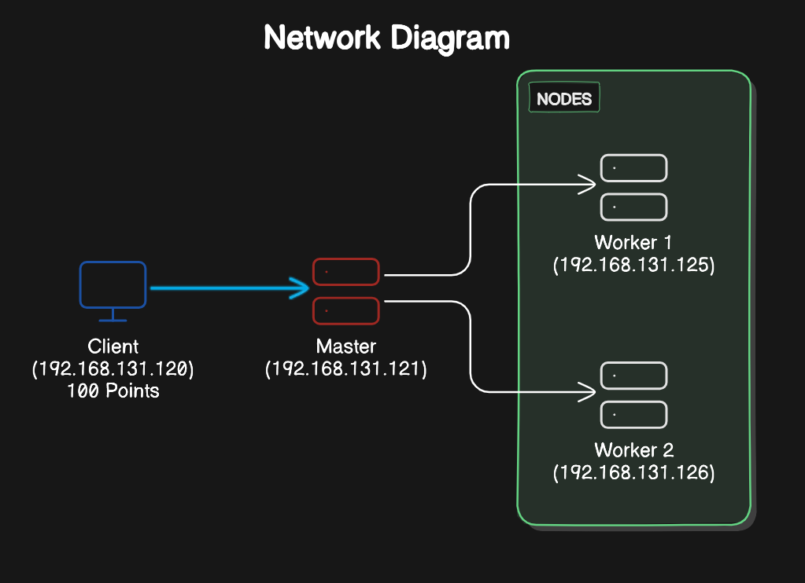
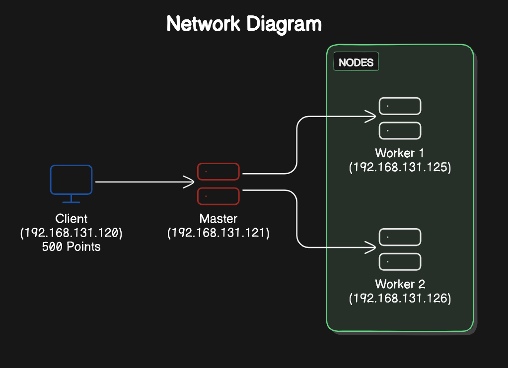
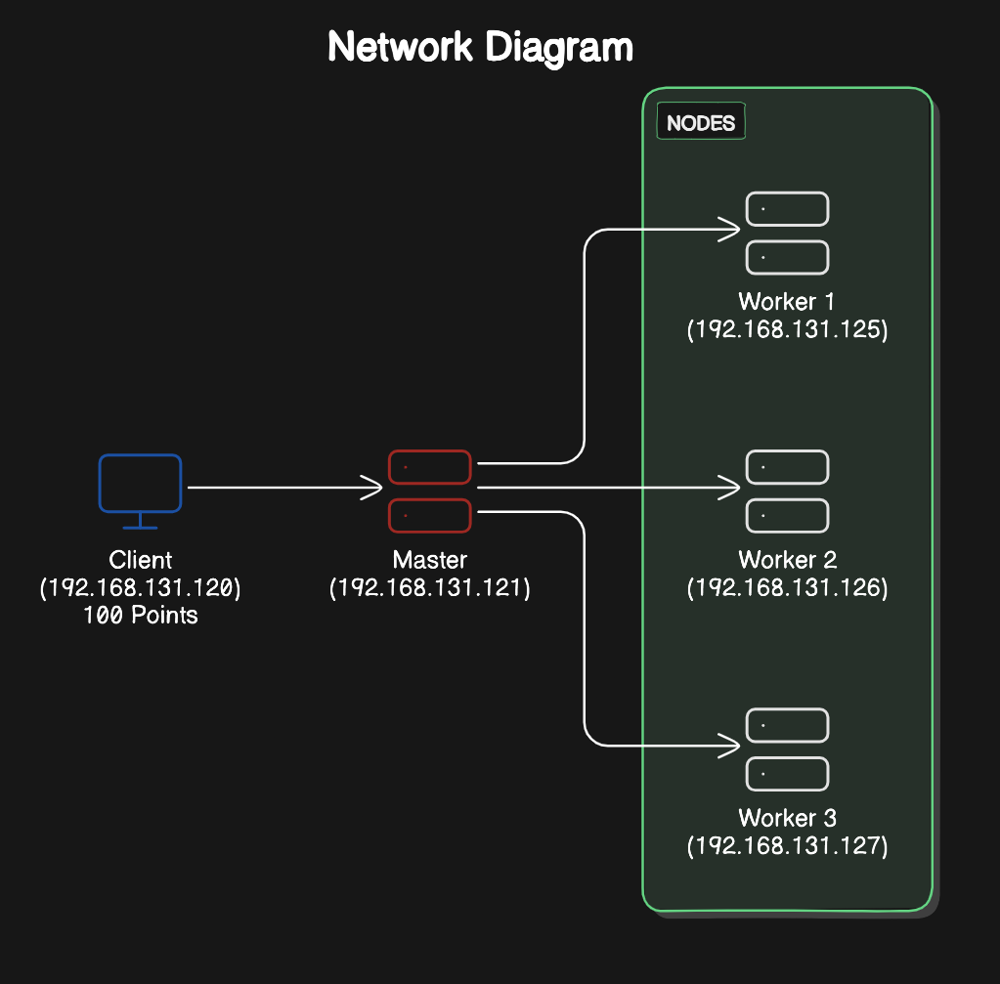
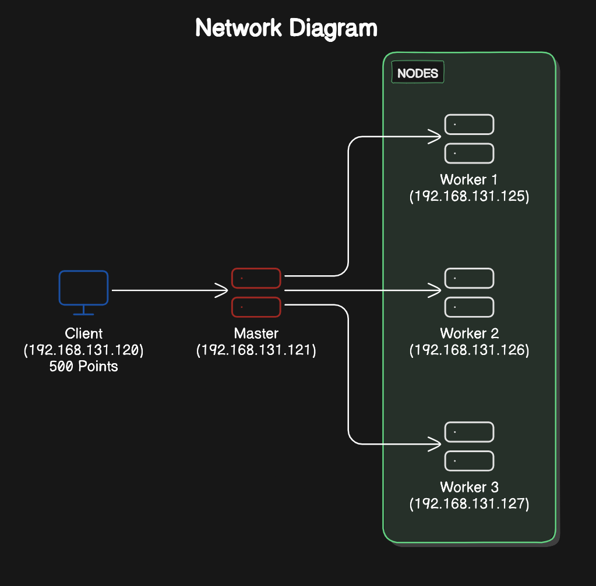

# Report

### Description of the Monte Carlo Method for Estimating π

The Monte Carlo method is a simulation technique based on the use of random numbers to approximate solutions to problems that may lack straightforward analytical solutions. In the case of estimating π, this method involves randomly throwing points within a square of side 2 centered at the origin and determining what proportion of these points falls within a circle inscribed within the square. Since the area of the square is 4 and the area of the inscribed circle is π, the ratio between the number of points inside the circle and the total number of points thrown approximates π/4. The formula for estimating π is then derived as follows:

\[
\pi \approx 4 \times \left(\frac{\text{number of points in the circle}}{\text{total points thrown}}\right)
\]

This method is popular for statistical estimates due to its simplicity and ease of parallelization, especially in distributed systems where the work can be divided across multiple nodes to improve efficiency and reduce runtime.

### Client-Master-Worker Model

To implement this calculation in a distributed manner, we use a **Client-Master-Worker** (hierarchical client-server) model in which roles are divided as follows:

1. **Client**:
   - The client acts as the initiator of the calculation. It sends a request to the master node, specifying the total number of points (N) to be thrown for estimating π.
   - The client also waits for the master's response with the final estimation of π once the distributed calculation is complete.

2. **Master**:
   - The master is responsible for coordinating the work among the various workers. When the master receives the client's request, it divides the total points (N) into smaller tasks and assigns each worker an equal or approximately equal number of points (N/n, where n is the number of workers).
   - The master collects individual results from each worker (specifically, the number of points that fell inside the circle) and sums them to obtain the total points within the circle. Using this total, the master calculates the estimate of π with the previously described formula and sends the result back to the client.

3. **Workers**:
   - Workers receive the task of throwing a specific number of random points within the square and count how many of those points fall within the inscribed circle.
   - Each worker returns to the master the number of points that fell inside the circle, allowing the master to perform the final π calculation.

### Task Distribution Strategy

To efficiently distribute the calculation, the master divides the total points \(N\) among the \(n\) workers. Each worker receives a task consisting of generating \(N/n\) random points and counting how many of these points fall within the circle. The task distribution follows this structure:

1. The master calculates how many points each worker must process and assigns the corresponding task to each one. We use the ceiling function for cases where points are not divisible by the number of workers.
2. Workers execute the Monte Carlo simulation in parallel, which reduces the total execution time compared to a sequential approach.
3. Once all workers complete their task, the master gathers the partial results and performs the final calculation of π, using the sum of points inside the circle provided by each worker.

### Solution Implementation Using ICE (Internet Communications Engine)

This model was implemented using **ICE (Internet Communications Engine)**, which facilitates distributed communication among the client, master, and worker nodes. ICE enables asynchronous communication, improving efficiency by preventing blocks while workers process the random points.

### Test Documentation

This section presents the results of the tests performed to estimate π using the Monte Carlo method in a distributed system implemented with ICE. Each test details the input and output points, performance analysis, and includes a representative network diagram for each configuration.

---

#### Test 1
- **Inputs**: 100 points, 1 worker.
- **Outputs**:
  - Estimated π: 3.12
  - Execution time: 11 ms
  - Points inside circle: 78
- **Performance Analysis**:
  With a single worker, the system processes the points quickly. However, due to the small sample size, the accuracy of π is limited.

---

#### Test 2
- **Inputs**: 500 points, 1 worker.
- **Outputs**:
  - Estimated π: 3.096
  - Execution time: 2 ms
  - Points inside circle: 387
- **Performance Analysis**:
  Increasing the number of points improves π's accuracy, while maintaining low execution time since a single worker was used, minimizing network latency.

---

#### Test 3
- **Inputs**: 100 points, 2 workers.
- **Outputs**:
  - Estimated π: 3.32
  - Execution time: 5129 ms
  - Points inside circle: 83 (Worker 1: 38, Worker 2: 45)
- **Performance Analysis**:
  Distributing points across two workers increases execution time due to communication overhead, especially with a low point count, where parallelization benefits are limited.

---

#### Test 4
- **Inputs**: 500 points, 2 workers.
- **Outputs**:
  - Estimated π: 3.2
  - Execution time: 4 ms
  - Points inside circle: 400 (Worker 1: 192, Worker 2: 208)
- **Performance Analysis**:
  With a larger point count, π's accuracy improves, and the execution time is reasonable, showing that the load is effectively distributed among the workers.

---

#### Test 5
- **Inputs**: 100 points, 3 workers.
- **Outputs**:
  - Estimated π: 3.24
  - Execution time: 5220 ms
  - Points inside circle: 81 (Worker 1: 27, Worker 2: 29, Worker 3: 25)
- **Performance Analysis**:
  This setup shows a high execution time for few points, mainly due to communication overhead and network latency at that time.

---

#### Test 6
- **Inputs**: 500 points, 3 workers.
- **Outputs**:
  - Estimated π: 3.208
  - Execution time: 21404 ms
  - Points inside circle: 401 (Worker 1: 127, Worker 2: 137, Worker 3: 137)
- **Performance Analysis**:
  Although the π estimate approaches the expected value, execution time increases considerably due to high network latency during the test.

---

### General Analysis
Overall, the tests show that the number of workers significantly impacts execution time, particularly when network traffic is high. We observe that with few points, parallelization introduces overhead that doesn't always yield performance gains. However, as the number of points increases, π’s accuracy improves, and using multiple workers effectively distributes the load as long as network conditions are optimal.

> **Note**: Execution times in some tests were high due to considerable network traffic during the tests.

### How Does Execution Time Vary with Increasing Network Nodes?

In a distributed system, the total workload is divided among the workers, which should reduce execution time as each worker handles only a portion of the points. With more workers, the master must manage more connections and coordinate communication with each one, introducing communication overhead, especially in a network with latency. Conversely, Amdahl’s Law states that performance will improve as the number of workers increases, but only up to a certain point. This implies that after an optimal number of workers, the benefit in reduced execution time diminishes, and eventually, execution time may stabilize or even worsen due to communication and coordination overhead.

***Sources***:
- https://www3.cs.stonybrook.edu/~rezaul/Spring-2012/CSE613/reading/Amdahl-1967.pdf
- https://vowi.fsinf.at/images/b/bc/TU_Wien-Verteilte_Systeme_VO_%28G%C3%B6schka%29_-_Tannenbaum-distributed_systems_principles_and_paradigms_2nd_edition.pdf